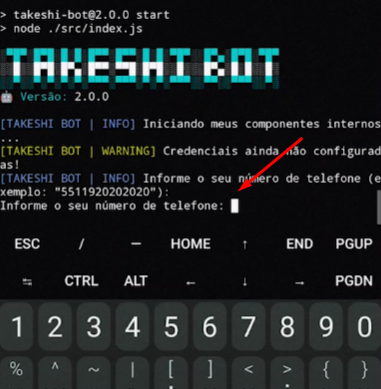

# 🤖 Takeshi Bot

<div align="center">
    
</div>

<br />

<div align="center">
    <a href="https://github.com/guiireal/takeshi-bot">
        
    </a>
</div>

<br />

## Bot de WhatsApp multifunções, desenvolvido no vídeo:

[CRIANDO UM BOT DE WHATSAPP DO ZERO (GUIA DEFINITIVO) - BASE COMPLETA + 6 COMANDOS - JAVASCRIPT](https://youtu.be/6zr2NYIYIyc)


## Tecnologias envolvidas

- [Axios](https://axios-http.com/ptbr/docs/intro)
- [Baileys](https://github.com/WhiskeySockets/Baileys)
- [FFMPEG](https://ffmpeg.org/)
- [Herc.ai](https://www.npmjs.com/package/hercai)
- [Node.js 20.17.0](https://nodejs.org/en)
- [Spider X API](https://api.spiderx.com.br)

## ⚠ Atenção

Nós não prestamos suporte gratuíto caso você tenha adquirido esta base com terceiros e tenha pago por isso. 
Solicite que **a pessoa que te vendeu, forneça suporte**.
Nós não temos vínculo nenhum com terceiros e não nos responsabilizamos por isso, nem prestamos suporte nessas condições.

Caso seu bot seja o oficial da Bronxys, 
interaja conosco e receba suporte através do grupo:
[https://chat.whatsapp.com/CaOn8owxr4zICaLkZdtyDT](https://chat.whatsapp.com/CaOn8owxr4zICaLkZdtyDT)

## Instalação no Termux (novo método)<a id="termux-new-setup"></a>

1 - Abra o Termux e execute os comandos abaixo.<br/>
_Não tem o Termux? [Clique aqui e baixe a última versão](https://www.mediafire.com/file/082otphidepx7aq/Termux_0.119.1_aldebaran_dev.apk)._

2 - Cole o seguinte código:

```sh
curl -O https://spiderx.com.br/bot-termux.sh && sh bot-termux.sh
```

3 - Se não tiver dado a permissão pra ler as pastas do dispositivo pelo termux, aceite quando aparecer o pop-up na tela, caso contrário, pressione `y`.

4 - Quando finalizar tudo, informe seu número de telefone.

5 - Coloque o código de pareamento em "dispositivos conectados" no WhatsApp, conforme explicado [nessa parte do vídeo](https://youtu.be/lBhpGuq5ETQ?t=76).



6 - Aguarde 10 segundos, depois digite `CTRL + C` para parar o bot.

7 - Configure o arquivo `config.js` que está dentro da pasta `src`. O bot fica dentro da pasta `/sdcard/DevGui`.

```js
// Prefixo dos comandos
exports.PREFIX = "/";

// Emoji do bot (mude se preferir).
exports.BOT_EMOJI = "🤖";

// Nome do bot (mude se preferir).
exports.BOT_NAME = "Takeshi Bot";

// Número do bot. Coloque o número do bot (apenas números).
exports.BOT_NUMBER = "5511920202020";

// Número do dono do bot. Coloque o número do dono do bot (apenas números).
exports.OWNER_NUMBER = "5511999999999";
```

7 - Inicie o bot novamente, dentro da pasta `takeshi-bot`:
```sh
npm start
```

## Instalação no Termux (método antigo)<a id="termux-old-setup"></a>

1 - Abra o Termux e execute os comandos abaixo.<br/>
_Não tem o Termux? [Clique aqui e baixe a última versão](https://www.mediafire.com/file/082otphidepx7aq/Termux_0.119.1_aldebaran_dev.apk)._

```
pkg upgrade -y && pkg update -y && pkg install git -y
```

2 - Habilite o acesso da pasta storage, no termux.
```sh
termux-setup-storage
```

3 - Entre na pasta storage (ou dê antes um `ls` e veja qual é o nome da pasta do seu cartão de memória e entre nela).
```sh
cd storage
```

4 - Clone o repositório.
```sh
git clone https://github.com/guiireal/takeshi-bot.git
```

5 - Entre na pasta que foi clonada.
```sh
cd takeshi-bot
```

6 - Execute o bot.
```sh
sh termux-start.sh
```

7 - Insira o número de telefone e pressione `enter`.

8 - Informe o código que aparece no termux, no seu WhatsApp, [assista aqui, caso não encontre essa opção](https://youtu.be/6zr2NYIYIyc?t=5395).

9 - Aguarde 10 segundos, depois digite `CTRL + C` para parar o bot.

10 - Configure o arquivo `config.js` que está dentro da pasta `src`.

```js
// Prefixo dos comandos
exports.PREFIX = "/";

// Emoji do bot (mude se preferir).
exports.BOT_EMOJI = "🤖";

// Nome do bot (mude se preferir).
exports.BOT_NAME = "Takeshi Bot";

// Número do bot. Coloque o número do bot (apenas números).
exports.BOT_NUMBER = "5511920202020";

// Número do dono do bot. Coloque o número do dono do bot (apenas números).
exports.OWNER_NUMBER = "5511999999999";
```

11 - Inicie o bot novamente.
```sh
npm start
```

## Alguns comandos necessitam de API

Edite a linha `34` do arquivo `./src/config.js` e cole sua api key da plataforma Spider X API.<br/>
Para obter seu token, acesse: [https://api.spiderx.com.br](https://api.spiderx.com.br) e crie sua conta gratuitamente!

```js
exports.SPIDER_API_TOKEN = "seu_token_aqui";
```
## Funcionalidades

| Função | Online? | Contexto | Requer a Spider X API?
| ------------ | --- | --- | ---
| Desligar o bot no grupo | ✅ | Dono | ❌
| Ligar o bot no grupo | ✅ | Dono | ❌
| Anti link | ✅ | Admin | ❌
| Banir membros | ✅ | Admin | ❌
| Ligar/desligar auto responder | ✅ | Admin | ❌
| Ligar/desligar boas vindas | ✅ | Admin | ❌
| Marcar todos | ✅ | Admin | ❌
| Busca CEP | ✅ | Membro | ❌
| Figurinha de texto animada | ✅ | Membro | ✅
| Geração de imagens com IA | ✅ | Membro | ❌
| GPT 4 | ✅ | Membro | ✅
| Ping | ✅ | Membro | ❌
| Play áudio | ✅ | Membro | ✅
| Play vídeo | ✅ | Membro | ✅
| Sticker | ✅ | Membro | ❌
| Sticker para imagem | ✅ | Membro | ❌

## Auto responder

O Takeshi Bot possui um auto-responder embutido, edite o arquivo em `./database/auto-responder.json`:

```json
[
    {
        "match": "Oi",
        "answer": "Olá, tudo bem?"
    },
    {
        "match": "Tudo bem",
        "answer": "Estou bem, obrigado por perguntar"
    },
    {
        "match": "Qual seu nome",
        "answer": "Meu nome é Taeshi Bot"
    },

    // coloque mais objetos json
]
```

## Estrutura de pastas

- 📁 assets ➔ _arquivos de mídia_
    - 📁 auth ➔ _arquivos da conexão do bot_
    - 📁 images ➔ _arquivos de imagem_
    - 📁 temp ➔ _arquivos temporários_
- 📁 database ➔ _arquivos de dados_
- 📁 node_modules ➔ _módulos do Node.js_
- 📁 src ➔ _código fonte do bot (geralmente você mexerá mais aqui)_
    - 📁 commands ➔ _pasta onde ficam os comandos_
        - 📁 admin ➔ _pasta onde ficam os comandos administrativos_
        - 📁 member ➔ _pasta onde ficam os comandos gerais (todos poderão utilizar)_
        - 📁 owner ➔ _pasta onde ficam os comandos de dono (grupo e bot)_
        - 📝\_sample.js ➔ _arquivo de exemplo de como criar um comando_
    - 📁 errors ➔ _classes de erros usadas nos comandos_
    - 📁 middlewares ➔ _interceptadores de requisições_
    - 📁 services ➔ _serviços diversos_
    - 📁 utils ➔ _utilitários_
    - 📝 config.js ➔ _arquivo de configurações do Bot_
    - 📝 connection.js ➔ _script de conexão do Bot com a biblioteca Baileys_
    - 📝 index.js ➔ _script ponto de entrada do Bot_
    - 📝 loader.js ➔ _script de carga de funções_
    - 📝 test.js ➔ _script de testes_
- 📝.gitignore ➔ _arquivo para não subir certas pastas no GitHub_
- 📝LICENSE ➔ _arquivo de licença_
- 📝linux-start.sh ➔ _arquivo de inicialização do bot no Linux_
- 📝package-lock.json ➔ _arquivo de cache das dependências do Bot_
- 📝package.json ➔ _arquivo de definição das dependências do Bot_
- 📝README.md ➔ _esta documentação_
- 📝termux-start.sh ➔ _arquivo de inicialização do bot no Termux_

## Erros comuns

### Operação negada ao extrair a pasta

O erro abaixo acontece quando é feito o download do arquivo ZIP direto no celular em algumas versões do apk ZArchiver e também de celulares sem root.

Para resolver, siga o [tutorial de instalação via git clone](#termux-new-setup).


## Remoção dos arquivos de sessão e conectar novamente

Caso dê algum erro na conexão, você pode apagar os arquivos dentro da pasta `/assets/auth/baileys`.

```sh
rm -rf ./asset/auth/baileys
```

Depois, remova o dispositivo do WhatsApp em "dispositivos conectados" e conecte-se novamente!

## Inscreva-se no canal!

<a href="https://www.youtube.com/@devgui_?sub_confirmation=1" target="_blank" rel="noopener noreferrer"></a>

## Licença

[GPL-3.0](https://github.com/guiireal/takeshi-bot/blob/main/LICENSE)

Este projeto está licenciado sob a Licença Pública Geral GNU (GPL-3.0).<br/>
Isso significa que:

- Você pode usar este código como quiser, seja para projetos pessoais ou comerciais.
- Você pode modificar o código para adaptá-lo às suas necessidades.
- Você pode compartilhar ou vender o código, mesmo modificado, mas precisa:
- Manter os créditos ao autor original (Guilherme França - Dev Gui).
- Tornar o código modificado disponível sob a mesma licença GPL-3.0.

O que você não pode fazer:

- Não pode transformar este código em algo proprietário (fechado) e impedir outras pessoas de acessá-lo ou usá-lo.
Esta licença garante que todos tenham acesso ao código-fonte e podem colaborar livremente, promovendo o compartilhamento e o aprimoramento do projeto.

## ⚠ Disclaimer

Neste projeto, precisei hospedar a node_modules, para auxiliar quem está rodando o bot pelo celular, pois muitos deles podem não rodar o `npm install` pelo termux corretamente.
