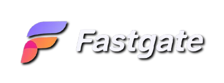
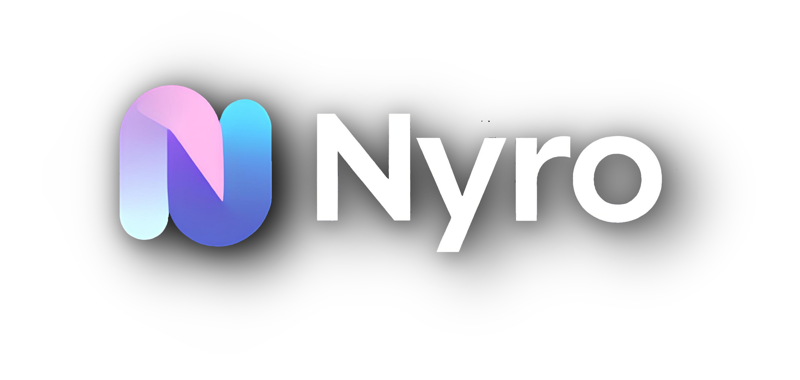

<br/>
<p align="center">

</p>
<h4 align="center">Fastgate provides free, secure, and easy-to-integrate proxy services for developers.</h4>

#

<p align="center"> 

<span align="center">Powered By Nyro</span>
</p>

#

<p align="center">

 

 
 

<a href="https://discord.gg/luppux" target="_blank"> 
 
</a>
<a href="https://www.buymeacoffee.com/beykant" target="_blank">

</a>
</p>

## Installation

Using npm:
```shell
$ npm install fastgate
```

Other Installations:

```bash
$ yarn add fastgate
```

```bash
$ pnpm add fastgate
```

## Usage
```js
import fastgate from 'fastgate';
    
/* Promise<ProxyAPIResponse> */
fastgate.getProxyList({
        country: ['tr'],
        protocol: ['http'],
        anonymity: ['Elite'],
        timeout: 5555
 }).then((response) => {
      console.log(response);
    });

/* Promise<ProxyObject | undefined> */
fastgate.getProxy({
   force: false,
   proxyOptions: {
     alive: true,
     timeout: (timeout) => {
      return timeout < 5000;
    },
     ip: (ip) => {
        return ip.startsWith('190');
    }
 }).then((response) => {
      console.log(response);
    });
```

## License

fastgate is licensed under the **GPL-3.0** License. See the [LICENSE](./LICENSE.md) file for details.

## Support

[](https://discord.gg/luppux)