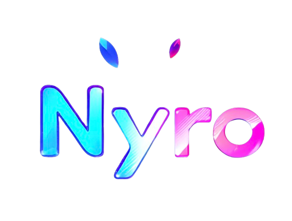

<br/>
<p align="center">

</p>
<h4 align="center">A simple and effective promise-based HTTP request library that supports all HTTP methods.</h6>
<p align="center">

 

 
 

<a href="https://discord.gg/luppux" target="_blank"> 
 
</a>
<a href="https://www.buymeacoffee.com/beykant" target="_blank">

</a>
</p>


## Installation

Using npm:
```shell
$ npm install nyro
```

Other Installations:

```bash
$ yarn add nyro
```

```bash
$ pnpm add nyro
```

## Usage
```js
import nyro, { ContentType, ResponseEncoding, ResponseType, StatusCode, Method } from 'nyro';

(async() => {

 var response = await nyro({
    url: 'https://hercai.onrender.com/v3/hercai',
    params: {
        question: 'Hi How Are You?'
    }
    method: Method.Get,
    responseType: ResponseType.Json,
    headers: {
        'Authorization': '...someOneSecretKey',
        'User-Agent': 'Nyro'
    },
    bodySchema: {
        content: String,
        reply: String
    }
 });

  var body = response.body;

  console.log('Your Question; ' + body.content);
  console.log('AI Reply; ' + body.reply);


})();
```
<br>

#### For Fake UserAgent
```js
import nyro, { userAgentGenerator } from 'nyro';

nyro({
    url: 'https://someoneapi.com',
    method: 'GET',
    headers: {
        'User-Agent': userAgentGenerator()
    }
}).then((response) => {
    console.log(response.config.headers);
    console.log(response.body);
});
```

## License

nyro is licensed under the **MIT** License. See the [LICENSE](./LICENSE.md) file for details.

## Support

[](https://discord.gg/luppux)