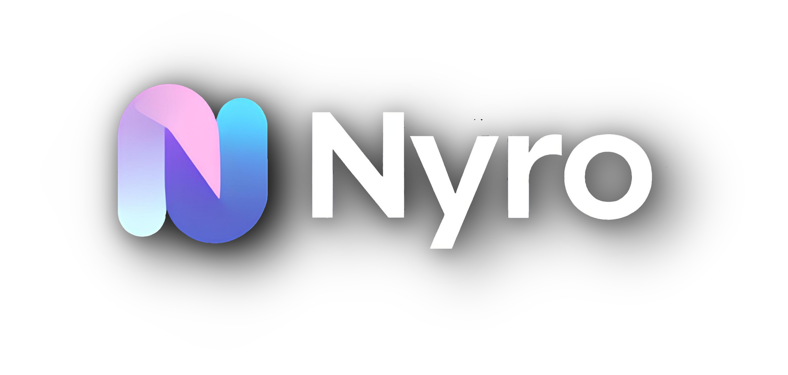
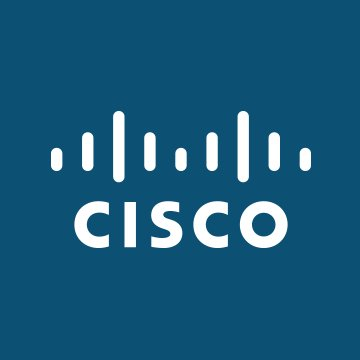

<br/>
<p align="center">

</p>
<h4 align="center">A simple and effective promise-based HTTP & HTTP/2 request library that supports all HTTP methods.</h6>
<p align="center">

 

 
 

<a href="https://discord.gg/luppux" target="_blank">
 
</a>
</p>


## Installation

Using npm:
```shell
$ npm install nyro@latest
```

Other Installations:

```bash
$ yarn add nyro@latest
```

```bash
$ pnpm add nyro@latest
```

```bash
$ deno install npm:nyro@latest
```

## Example Basic Usage
```js
import nyro, { ResponseType, Method } from 'nyro';

(async() => {

 const { body } = await nyro({
    url: 'https://hercai.onrender.com/v3/hercai',
    params: {
        question: 'Hi How Are You?'
    }
    method: Method.Get, // Or 'GET'
    responseType: ResponseType.Json, // Or 'json'
    headers: {
        'User-Agent': 'Nyro'
    },
    bodySchema: {
        content: String,
        reply: String
    }
 });

  console.log('Your Question; ' + body.content);
  console.log('AI Reply; ' + body.reply);


})();
```
<br>

## Documentation

#### Main Request

- [x] [`Promise Requests`](documentation/promise.md)
- [x] [`Options`](documentation/options.md)
- [x] [`Stream Request`](documentation/stream.md)
- [x] [`Queue Request`](documentation/queue.md)
- [x] [`Pagination API`](documentation/pagination.md)
- [x] [`Create / Extend Request`](documentation/create-extend.md)
- [x] [`HTTP/2 Support`](documentation/http2.md)
- [x] [`Response`](documentation/response.md)

#### Timeouts, Retries And Error

- [x] [`Timeout`](documentation/timeout.md)
- [x] [`Retries`](documentation/retry.md)
- [x] [`Error`](documentation/error.md)

#### Other Options

- [x] [`Cache`](documentation/cache.md)
- [x] [`Proxy Support`](documentation/proxy.md)
- [x] [`Abort / Cancel Request`](documentation/abort.md)
- [x] [`BodySchema`](documentation/bodyschema.md)
- [x] [`SSL Options`](documentation/ssl.md)
- [x] [`Browser Support (Node Only)`](documentation/browser.md)

#### Advanced Options

- [x] [`Events & Callbacks`](documentation/events.md)
- [x] [`Plugins & Advanced Callbacks`](documentation/plugins.md)

#### Special Features

- [x] [`Advanced User Agent Generator`](documentation/user-agent.md)
- [x] [`Get Advanced Alive Proxy`](documentation/get-proxy.md)
- [x] [`Layer7 Attack 🤪`](documentation/layer7.md)

<br>

## License

Nyro is licensed under the **GPL-3.0** License. See the [LICENSE](./LICENSE.md) file for details.

## Support

[](https://discord.gg/luppux)

<br>
<br>

<table align="center" width="100%">
<tr>
<td align="center"> 
<a href="https://www.netacad.com/" style="padding: 10px; display: inline-block"> 
 
<p align="center">Free online courses. In-person learning. Certification-aligned pathways in topics like Cybersecurity, Networking, and Python.
It’s all here. Are you ready to begin, change, or propel your career?</p> 
</a>
</td>
</tr>